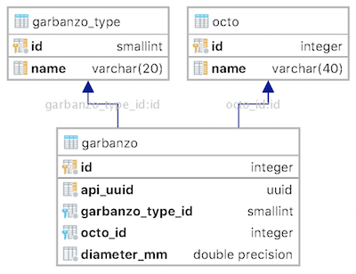

[](https://goreportcard.com/report/myshkin5/effective-octo-garbanzo)

# effective-octo-garbanzo

This is an opinionated* reference implementation of a Go microservice. It is not intended to be used as production code but it is written with the (opinionated*) standards of production code.

Whenever possible, idiomatic Go is used with as few dependencies (opinionated*) as possible. Go's idiom of using very short variable names is not followed much. I mostly agree with this idiom but when introducing a new language, I feel verbosity is best.

\* If you have a different opinion that you think would make this implementation better, file an issue or send me a pull request.

## What does it do?

`effective-octo-garbanzo` is a microservice that sits on its own Postgres relational database. The name was autogenerated by GitHub's new repository form. Per the name, the service serves _Octos_ and _Garbanzos_ in a parent/child relationship. _Octos_ have a `name` attribute which must be unique (the name is included in the resource URI). _Garbanzos_ have a `type` attribute (valid types are `DESI` and `KABULI`) and a `diameter-mm` attribute which must be a positive decimal number.



The database schema is [migrated](https://github.com/mattes/migrate) on startup from a [self-contained schema](./persistence/ddl/001_initial.up.sql). Note that multiple migrations are supported but since this is reference implementation, only one migration will ever be included here.

## Running the tests

There are several dependencies that need to be installed prior to running the tests:

* `goimports` `go get golang.org/x/tools/cmd/goimports`
* `ginkgo` `go get github.com/onsi/ginkgo/ginkgo`
* `docker-compose` https://docs.docker.com/compose/install/
* Docker https://docs.docker.com/engine/installation/

There are several Go dependencies that are vendored as git submodules. Run the following after cloning the repository and after each pull:

```bash
git submodule update --init --recursive
```

Finally to actually run the tests:

```bash
./scripts/test
```
## Running the code

Either by running the tests or by running the following script, a docker image is created:

```bash
./scripts/build
```

## API Documentation

HATEOAS

Endpoint |
--- |
[`GET /`](#get-) |
[`GET /health`](#get-health) |
[`GET /octos`](#get-octos) |
[`POST /octos`](#post-octos) |
[`GET /octos/:octoName`](#get-octosoctoname) |
[`DELETE /octos/:octoName`](#delete-octosoctoname) |
[`GET /octos/:octoName/garbanzos`](#get-octosoctonamegarbanzos) |
[`POST /octos/:octoName/garbanzos`](#post-octosoctonamegarbanzos) |
[`GET /octos/:octoName/garbanzos/:apiUUID`](#get-octosoctonamegarbanzosapiuuid) |
[`DELETE /octos/:octoName/garbanzos/:apiUUID`](#delete-octosoctonamegarbanzosapiuuid) |

### Standard Response Headers

`Content-Type: application/json`

### Standard Error Response Body

Field | Description
--- | ---
`code` | The HTTP status code of the response.
`error` | The summary error message of the response.
`errors` | The list of specific errors (optional, only present when there are multiple errors).
`status` | The descriptive status code.

#### Example
```json
{
    "code":   400,
    "error":  "Error creating new octo",
    "errors": [
        "name must be present",
        "name must match regular expression '^[\\w-]+$'"
    ],
    "status": "Bad Request"
}
```

### `GET /`

#### Response Statuses

`200 - OK`: Only `200 - OK` is returned.

#### OK Response Body

Field | Description
--- | ---
`health` | Link to the health endpoint.
`octos` | Link to the octos collection endpoint.

##### Example

```json
{
    "health": "http://localhost:8080/health",
    "octos":  "http://localhost:8080/octos"
}
```

### `GET /health`

#### Response Statuses

`200 - OK`: Currently only `200 - OK` is returned.

#### OK Response Body

Field | Description
--- | ---
`health` | The health of the service. Currently only `GOOD` is supported.

##### Example

```json
{
    "health": "GOOD"
}
```

### `GET /octos`

#### Response Statuses

`200 - OK`: Returned on success.

`500 - Internal Server Error`: Returned when there is an internal server error. The [standard error body](#standard-error-response-body) is returned.

#### OK Response Body

Returns a list of octos. See [`GET /octos/:octoName`](#get-octosoctoname) for the definition of an octo.

##### Example

```json
[
    {
        "link":      "http://localhost:8080/octos/kraken",
        "name":      "kraken",
        "garbanzos": "http://localhost:8080/octos/kraken/garbanzos"
    }
]
```

### `POST /octos`

#### Request Body

Field | Description
--- | ---
`name` | The name of the new octo to be created.

##### Example

```json
{
    "name": "kraken"
}
```

#### Response Statuses

`201 - Created`: The octo was successfully created.

`400 - Bad Request`: The request was malformed and could not be processed. The [standard error body](#standard-error-response-body) is returned.

`500 - Internal Server Error`: Returned when there is an internal server error. The [standard error body](#standard-error-response-body) is returned.

#### Created Response Body

Returns the newly created octo. See [`GET /octos/:octoName`](#get-octosoctoname) for the definition of an octo.

##### Example

```json
{
    "link":      "http://localhost:8080/octos/kraken",
    "name":      "kraken",
    "garbanzos": "http://localhost:8080/octos/kraken/garbanzos"
}
```

### `GET /octos/:octoName`

#### Request Parameters

Field | Description
--- | ---
`octoName` | The name of the octo to be retrieved.

#### Response Statuses

`200 - OK`: Returned on success.

`400 - Bad Request`: The request was malformed and could not be processed. The [standard error body](#standard-error-response-body) is returned.

`404 - Not Found`: The requested octo could not be found. The [standard error body](#standard-error-response-body) is returned.

`500 - Internal Server Error`: Returned when there is an internal server error. The [standard error body](#standard-error-response-body) is returned.

#### OK Response Body

Field | Description
--- | ---
`link` | This resource.
`name` | The name of the octo.
`garbanzos` | Link to the garbanzos collection endpoint for this octo.

##### Example

```json
{
    "link":      "http://localhost:8080/octos/kraken",
    "name":      "kraken",
    "garbanzos": "http://localhost:8080/octos/kraken/garbanzos"
}
```

### `DELETE /octos/:octoName`

#### Request Parameters

Field | Description
--- | ---
`octoName` | The name of the octo to be deleted.

#### Response Statuses

`204 - No Content`: Returned on success.

`400 - Bad Request`: The request was malformed and could not be processed. The [standard error body](#standard-error-response-body) is returned.

`404 - Not Found`: The requested octo could not be found. The [standard error body](#standard-error-response-body) is returned.

`500 - Internal Server Error`: Returned when there is an internal server error. The [standard error body](#standard-error-response-body) is returned.

### `GET /octos/:octoName/garbanzos`

#### Request Parameters

Field | Description
--- | ---
`octoName` | The name of the octo for which garbanzos are to be retrieved.

#### Response Statuses

`200 - OK`: Returned on success.

`400 - Bad Request`: The request was malformed and could not be processed. The [standard error body](#standard-error-response-body) is returned.

`404 - Not Found`: The requested octo could not be found. The [standard error body](#standard-error-response-body) is returned.

`500 - Internal Server Error`: Returned when there is an internal server error. The [standard error body](#standard-error-response-body) is returned.

#### OK Response Body

Returns a list of garbanzos. See [`GET /octos/:octoName/garbanzos/:apiUUID`](#get-octosoctonamegarbanzosapiuuid) for the definition of an garbanzo.

##### Example

```json
[
    {
        "link":        "http://localhost:8080/octos/kraken/garbanzos/ac2f1146-c26b-45a7-b72d-3dcaa94c1913",
        "type":        "DESI",
        "diameter-mm": 4.5
    }
]
```

### `POST /octos/:octoName/garbanzos`

#### Request Parameters

Field | Description
--- | ---
`octoName` | The name of the octo in which a new garbanzo will be created.

#### Request Body

Field | Description
--- | ---
`type` | The type of the new garbanzo to be created (either `DESI` or `KABULI`).
`diameter-mm` | The diameter of the new garbanzo in millimeters.

##### Example

```json
{
    "type":        "DESI",
    "diameter-mm": 4.5
}
```

#### Response Statuses

`201 - Created`: The garbanzo was successfully created.

`400 - Bad Request`: The request was malformed and could not be processed. The [standard error body](#standard-error-response-body) is returned.

`409 - Conflict`: The parent octo could not be found. The [standard error body](#standard-error-response-body) is returned.

`500 - Internal Server Error`: Returned when there is an internal server error. The [standard error body](#standard-error-response-body) is returned.

#### Created Response Body

Returns the newly created garbanzo. See [`GET /octos/:octoName/garbanzos/:apiUUID`](#get-octosoctonamegarbanzosapiuuid) for the definition of an garbanzo.

##### Example

```json
{
    "link":        "http://localhost:8080/octos/kraken/garbanzos/ac2f1146-c26b-45a7-b72d-3dcaa94c1913",
    "type":        "DESI",
    "diameter-mm": 4.5
}
```

### `GET /octos/:octoName/garbanzos/:apiUUID`

#### Request Parameters

Field | Description
--- | ---
`octoName` | The name of the octo for which a garbanzo will be retrieved.
`apiUUID` | The API UUID of the garbanzo to be retrieved.

#### Response Statuses

`200 - OK`: Returned on success.

`400 - Bad Request`: The request was malformed and could not be processed. The [standard error body](#standard-error-response-body) is returned.

`404 - Not Found`: The requested garbanzo could not be found. The [standard error body](#standard-error-response-body) is returned.

`500 - Internal Server Error`: Returned when there is an internal server error. The [standard error body](#standard-error-response-body) is returned.

#### OK Response Body

Field | Description
--- | ---
`link` | This resource.
`type` | The type of the garbanzo (either `DESI` or `KABULI`).
`diameter-mm` | The diameter of the garbanzo in millimeters.

##### Example

```json
{
    "link":        "http://localhost:8080/octos/kraken/garbanzos/ac2f1146-c26b-45a7-b72d-3dcaa94c1913",
    "type":        "DESI",
    "diameter-mm": 4.5
}
```

### `DELETE /octos/:octoName/garbanzos/:apiUUID`

#### Request Parameters

Field | Description
--- | ---
`octoName` | The name of the octo for which a garbanzo will be deleted.
`apiUUID` | The API UUID of the garbanzo to be deleted.

#### Response Statuses

`204 - No Content`: Returned on success.

`400 - Bad Request`: The request was malformed and could not be processed. The [standard error body](#standard-error-response-body) is returned.

`404 - Not Found`: The requested garbanzo could not be found. The [standard error body](#standard-error-response-body) is returned.

`500 - Internal Server Error`: Returned when there is an internal server error. The [standard error body](#standard-error-response-body) is returned.
